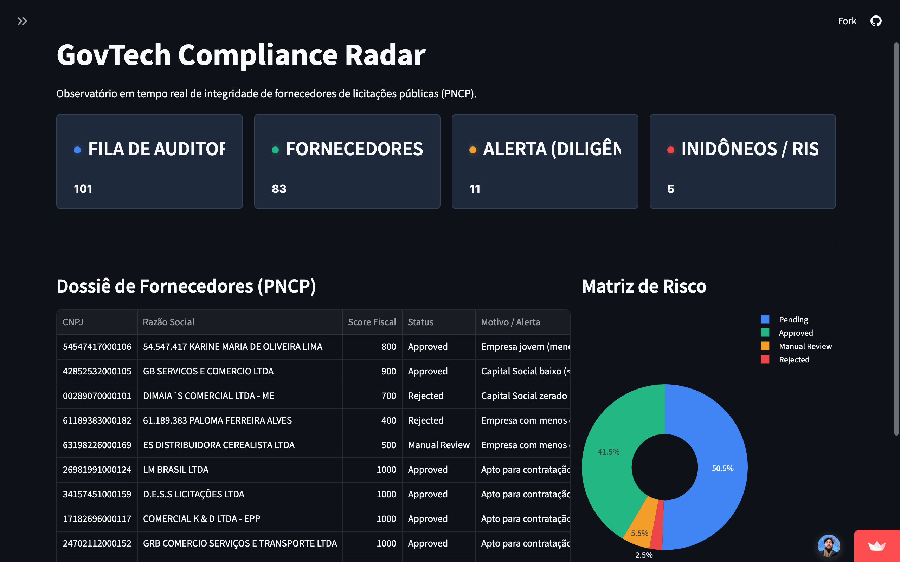
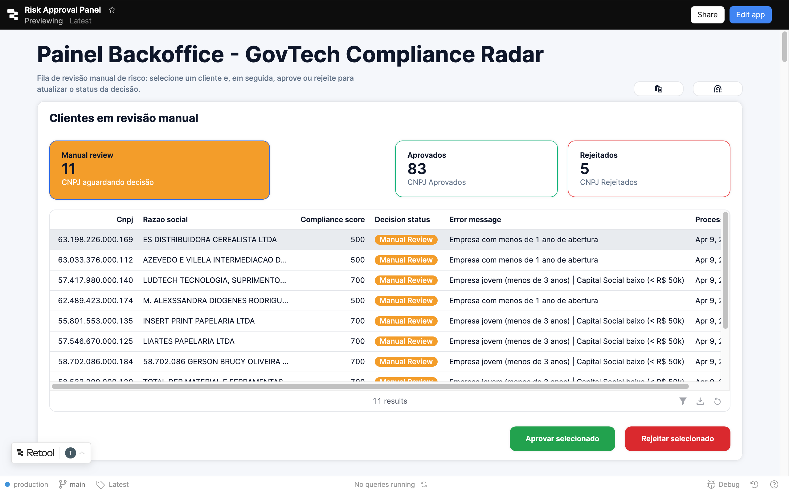

> ⚠︎ **Nota de Evolução Arquitetural e Dados:** Este repositório foi originalmente concebido como o *RPA Client Risk Bot* (Análise de Risco de Crédito B2C). Devido à robustez e ao alto grau de desacoplamento da arquitetura (API-First), o projeto foi **pivotado com sucesso** para o setor GovTech (B2G). O sistema consome dados públicos reais e abertos do Governo Federal, garantindo total conformidade com a LGPD. O código-fonte representa um estudo de caso arquitetural de nível Enterprise focado em resiliência e auditoria.

 

  <h1>❖ GovTech Compliance Radar</h1>
  <h3>Ecossistema de Auditoria de Fornecedores e RPA B2G</h3>
  
  
  
  
  
  
  

 

  <h2>⟡ <a href="https://rpa-client-risk-bot-thiago-p-almeida.streamlit.app/ target="_blank">Acessar Observatório Executivo (Streamlit)</a></h2>
  <h2>⟡ <a href="https://thgsolutions.retool.com/apps/f53cabd6-338e-11f1-86de-032cbaeeb67b/Risk%20Approval%20Panel/page1" target="_blank">Acessar Backoffice de Operações (Retool)</a></h2>
  
<i>O painel de Backoffice requer credenciais de acesso corporativo para simular o ambiente de aprovação Human-in-the-Loop.</i>

 

## ❖ O Desafio de Negócio (Business Case) 
Com a vigência da Nova Lei de Licitações (Lei 14.133/2021), o volume de contratações públicas no Brasil atingiu patamares históricos. O Portal Nacional de Contratações Públicas (PNCP) registra milhares de novos editais e contratos mensalmente, movimentando bilhões de reais.

O gargalo operacional encontra-se na **Homologação de Fornecedores**. Agentes públicos e pregoeiros gastam semanas em tarefas manuais repetitivas, cruzando CNPJs em dezenas de portais governamentais para garantir a idoneidade fiscal e jurídica das empresas vencedoras. Esse processo manual é lento, custoso e suscetível a falhas humanas que podem resultar em responsabilização legal grave (Improbidade Administrativa). O **GovTech Compliance Radar** resolve este problema atuando como um investigador digital autônomo, auditável e em tempo real.

---

## ⬚ Visão Geral da Interface (Screenshots)

  
  

---

## ⬢ Arquitetura e Engenharia de Software
Este projeto foi desenhado sob os princípios do *Twelve-Factor App*, garantindo que cada componente seja desacoplado, sustentável, leve e infinitamente escalável.

### 1. Padrões Arquiteturais Aplicados
* **API-First & Microsserviços:** Separação estrita entre o Robô de Ingestão (RPA), o Motor de Regras (Flask API) e as Interfaces de Usuário (Streamlit/Retool).
* **Compliance as Code (White-Box):** O motor de regras traduz leis fiscais em código puro. Decisões de aprovação ou rejeição geram motivos explícitos e rastreáveis, eliminando o viés de "caixa preta" inaceitável no setor público.
* **Idempotência e Fila Avançada:** Uso de *Common Table Expressions (CTEs)* e *Window Functions* no PostgreSQL para garantir que o robô processe apenas o estado mais recente de cada fornecedor, evitando duplicidade de processamento e concorrência (Race Conditions).

### 2. Infraestrutura e Resiliência
* **Tolerância a Falhas (Retry Policy):** Implementação de *Throttling* (limite de taxa) e *Exponential Backoff* para lidar com instabilidades e *timeouts* comuns em APIs governamentais, respeitando um limite estrito de retentativas.
* **Append-Only Audit Trail:** O banco de dados relacional nunca apaga ou sobrescreve um status. Toda tentativa gera uma nova linha, criando uma trilha de auditoria imutável e pronta para inspeções de órgãos de controle (TCU/CGU).
* **Segurança (Zero Trust):** Credenciais de banco de dados e SMTP isoladas via variáveis de ambiente (`.env` e Secrets Management), prevenindo vazamentos no controle de versão.

### 3. Data Quality & Ingestão
* O módulo de ingestão consome a API RESTful do PNCP, aplicando *Data Cleansing* em tempo real para higienizar documentos (CNPJs) e descartar anomalias (CPFs ou dados malformados) antes da inserção em lote (*Bulk Insert* O(1)) no banco de dados.

---

## ⚙︎ Stack Tecnológica

### Backend & Lógica
- **Python 3.11:** Core language isolada em ambientes virtuais (`venv`).
- **Flask:** Framework leve para roteamento do Motor de Regras RESTful.
- **Requests & Psycopg2:** Consumo de APIs externas e transações otimizadas de banco de dados.

### Frontend & UI/UX
- **Streamlit:** Observatório executivo reativo com injeção de CSS *Custom properties* (Design System Slate & Signal).
- **Retool:** Painel de Backoffice Low-Code focado em operações *Human-in-the-Loop* (HITL).
- **Plotly Express:** Gráficos interativos e polimórficos para análise de matriz de risco.

### DevOps & Infraestrutura
- **Supabase (PostgreSQL):** Provisão do Banco de Dados Cloud-Native com *Connection Pooling* (PgBouncer) ativo.
- **SMTP (MIME/HTML):** Módulo de notificação assíncrona para envio de relatórios gerenciais diários.

---

## ◈ Funcionalidades Principais (Features)
- **Ingestão Autônoma (PNCP):** O robô varre contratos públicos assinados nas últimas 24 horas e isola os CNPJs das empresas vencedoras.
- **Data Enrichment (Brasil API):** O Agente Investigador extrai o dossiê fiscal completo da empresa (Status na Receita, Idade, Capital Social) sem intervenção humana.
- **Observatório Executivo:** Dashboard em tempo real calculando a volumetria da fila de auditoria, empresas aptas e inidôneas.
- **Human-in-the-Loop (HITL):** Painel operacional onde analistas avaliam casos de "Diligência" (Score intermediário), aprovando ou rejeitando com reflexo imediato no banco de dados.
- **Relatórios Automatizados:** Geração de dossiês em Excel (`.xlsx`) com correção de *Timezone Drift* e disparo automático via e-mail institucional.

---

## § Licença e Direitos Autorais

Other License

Copyright (c) 2026 Thiago P. Almeida. Todos os direitos reservados.

Este código-fonte é de propriedade exclusiva e confidencial. É estritamente proibida a cópia, reprodução, distribuição, comercialização ou modificação, parcial ou total, sem autorização prévia por escrito..

---

  <small>Arquitetura de Soluções e Engenharia de Software desenvolvida por <a href="https://github.com/thiago-p-almeida">Thiago P. Almeida</a></small>

